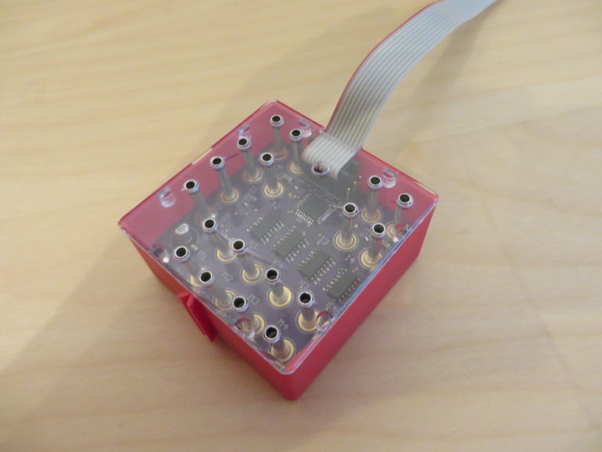

# ftroboext
Self-made fischertechnik Robo Extension based on a ATmega328

 

I own a RoboInterface (yes, the old) from fischertechnik, but no
Extension module for it. It's difficult to find some now, so I build
my own. This repository contains the hardware as EAGLE files and the
software as an Arduino sketch. The PCB is designed to fit nicely into
a box (Art.Nr. 130961).

More information (in german) can be found on [my blog](http://niklas-rother.de/tags/ftroboext/).

I currently have two unpopulated PCBs here, contact me if you have interest
in them.

## Hardware
The hardware is quite packed because it has to fit inside the box. This is
also the reason why there are only four inputs (I1-I4). Everything is SMD
for the same reason, but can be hand-soldered quite well, the biggest problem
is the ATmega, but it is doable.

The hardware has a few bugs, see below. Some will be fixed in a new revision,
some are impossible to fix. The biggest problem is, that the voltage on
O2,O4,O6 and O8 can not be controlled, they are always the same as O1,O3,O5 and O7.
This is because the driver has only one enable pin for both outputs, a fact I
missed when selecting the chip.

### Revision A
* Footprint for C2 is wrong (too large)
* Footprints for the connectors are a bit large
* EXT header is mirrored/label is wrong
* The `/SS` pin is not pulled low. To fix this, cut the `ADDR1` pin from the header, solder
it to GND (the pin next to it) and remove R14.

## Software
The protocol for the extension module was reversed-engineered by *thkais* and
can be found [on this website](https://web.archive.org/web/20150218211103/http://www.ft-fanpage.de/roboint/roboext.html)

The current software implements the basic functionality. Analog values are not
implemented. Only a single extension, EXT1 is emulated and chaining is not supported.

## Disclaimer
This is project is not affiliated or endorsed by fischertechnik. It's just
a project by a fan.